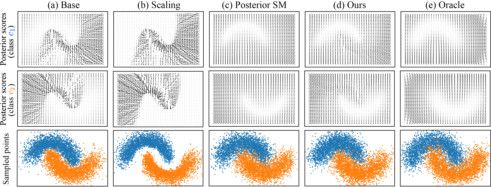

# Denoising Likelihood Score Matching for Conditional Score-based Data Generation

[](https://arxiv.org/abs/2203.14206)<br>

This repository includes the official implementation for the motivational experiments in the paper [Denoising Likelihood Score Matching for Conditional Score-based Data Generation](https://openreview.net/forum?id=LcF-EEt8cCC&referrer=%5BAuthor%20Console%5D(%2Fgroup%3Fid%3DICLR.cc%2F2022%2FConference%2FAuthors%23your-submissions)).



The code implementation for the experiments on the real-world datasets (Cifar-10 and Cifar-100) is in [chen-hao-chao/dlsm](https://github.com/chen-hao-chao/dlsm).

## Dependencies
Install the necessary python packages through the following command.
```
pip install -r requirements.txt
```

## Usage
Train and evaluate the model using the following command.
```
python main.py --mode {train / eval} --workdir {$directory} --config {$configuration} 
```
- `--mode`: `train` for training `eval` for evaluation.
- `--workdir`: the directory created for saving the experimental results such as visualized examples and checkpoints.
- `--config`: the configuration file that specifies the hyper-parameters.

### Examples
- Train the score model
```
python main.py --workdir score_cond --mode train --config configs/score/inter_twinning_moon_configs.py 
python main.py --workdir score_cond_lower --mode train --config configs/score/inter_twinning_moon_configs_lower.py
python main.py --workdir score_cond_upper --mode train --config configs/score/inter_twinning_moon_configs_upper.py
```
- Train the classifier
```
python main.py --workdir classifier_cond_total --mode train --config configs/classifier/inter_twinning_moon_configs_total.py
python main.py --workdir classifier_cond_ce --mode train --config configs/classifier/inter_twinning_moon_configs_ce.py
python main.py --workdir classifier_cond_dlsm --mode train --config configs/classifier/inter_twinning_moon_configs_dlsm.py
```
> Please note that for the setups involving the total loss or the ce loss, please make sure the pretrained score models are placed at `training.score_restore_path` identified in the configuration file.

> Please note that you could add a `--plot` flag to save the training information for plotting (Fig. 5 in the manuscript). By doing so, `run_lib_classifier_plot.py` will be executed, and the training loss will be saved in the `tensorboard` folder.

> Please note that `noise_conditioned` in the configuration files is defaultly turned on for training noise-conditioned score models and classifiers. In particular, `weighting_ce` and `weighting_dlsm` in the configuration files refer to the balancing factors for different noise levels. 

- Evaluate
```
python main.py --workdir test_eval --mode eval --config configs/eval/inter_twinning_moon_configs.py
```
> Please note that `type` in the configuration file controls the evaluation modes. For `type = distance`, the L2 distances between the estimated scores and the oracle scores will be calculated. For `type = sampling`, the sampling quality will be evatuated. 

## Citing DLSM
If you find this code useful, please consider citing our paper.
```bib
@inproceedings{
  chao2022denoising,
  title={Denoising Likelihood Score Matching for Conditional Score-based Data Generation},
  author={Chen-Hao Chao and Wei-Fang Sun and Bo-Wun Cheng and Yi-Chen Lo and Chia-Che Chang and Yu-Lun Liu and Yu-Lin Chang and Chia-Ping Chen and Chun-Yi Lee},
  booktitle={International Conference on Learning Representations},
  year={2022},
  url={https://openreview.net/forum?id=LcF-EEt8cCC}
}
```

## License

The code in this repository is licensed under the [Apache-2.0 License](LICENSE).
